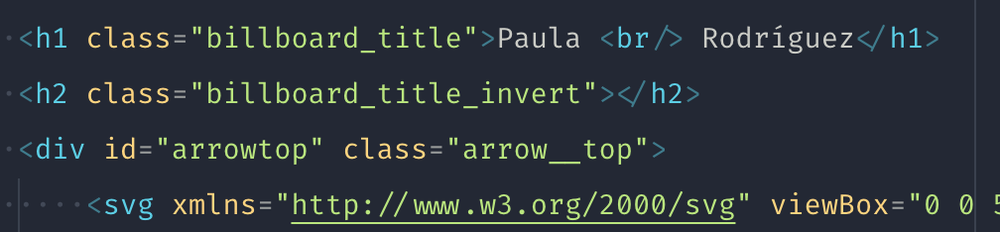
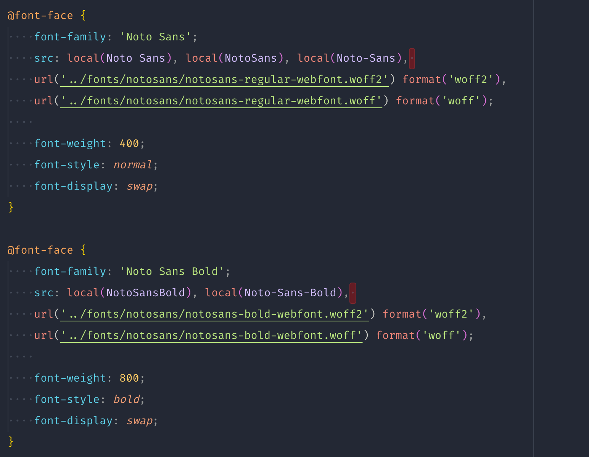
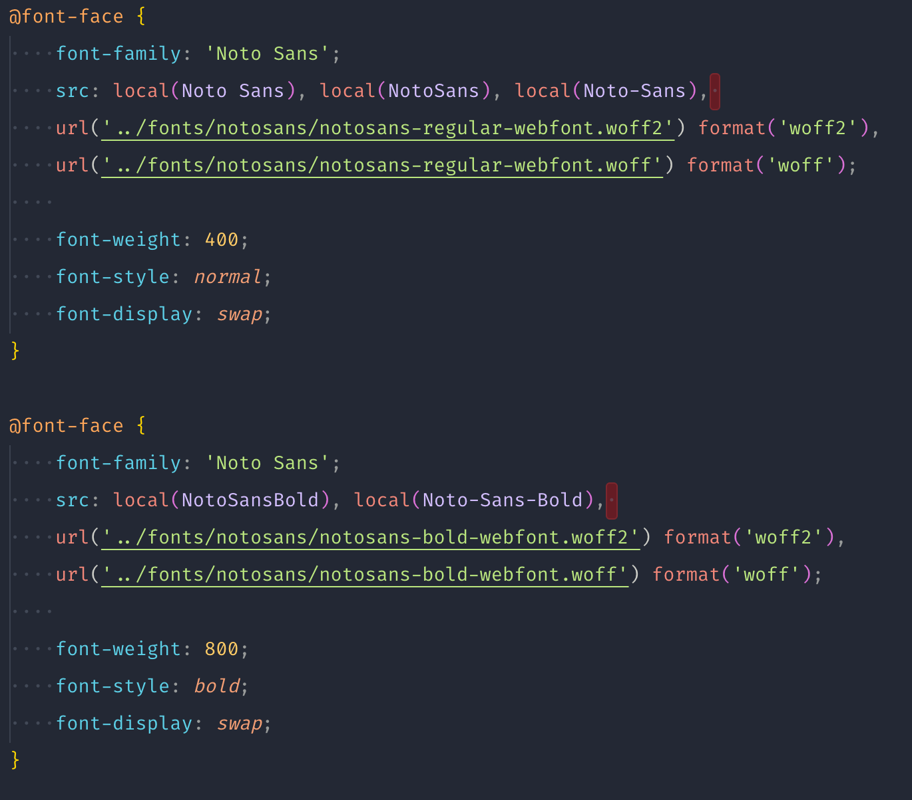

# Review final

Muy buen trabajo! Tienes un código muy organizado y limpio. Se nota mucho que has investigado y te has esforzado por mantenerlo en orden y siguiendo buenas prácticas, así que enhorabuena por tu esfuerzo y dedicación. Te doy algo de feedback para que puedas seguir mejorando.

En la sección que cambia el texto es importante tener un texto inicial o de _fallback_. Esto es en caso no haya podido cargar el Javascript que crea la animación o la persona haya desactivado el Javascript en su navegador, lo cual no es común, pero puede pasar. Y en este caso, no lo consideraría como titular. Un titular (heading) es para indicar una sección marcada, tal como lo has hecho para las secciones del menú.



Yo lo dejaría de la siguiente manera, así, si no carga el Javascript, siempre se mostrará algún texto:

```html
<h2 class="billboard_title_invert">UX Designer</h2>
```

Ten cuidado con el mail del footer, el texto es muy largo y está haciendo que te genere un scroll horizontal en dispositivos pequeños. Opciones, hacer el texto más pequeño o hacer que se rompa por cada letra con la propiedad `word-break: break-all;`


En relación a las familias tipográficas, no es necesario definir un nombre por cada variante (bold, normal, thin...). Es suficiente con un nombre y lo que cambia es el `weight`




De esta manera solo tienes que definir el `weight` en los estilos, por ejemplo:

```css
h1 {
    font-size: 2rem;
    font-weight: 800;
}

.title {
    font-size: 1.25rem;
    font-weight: 300;
}
```

En cuanto a las imágenes, genial que hayas utilizado webp, ya que te reduce mucho el peso y la carga de la web, pero, en el resto, ten en cuenta el tamaño, veo que varias que pesa bastante y harán más lenta tu página. En principio no deberían pesar más de 300/400 KB (las imágenes grandes) o por lo menos, menos de 1MB (si son muy grandes). Actualmente tienes alguna imagen de varios megas, tienes [algunas opciones online](https://tinypng.com/) para optimizarlas.

Por otro lado, webp es una buena opción, pero Safari no lo soporta, así que para compatibilidad con navegadores te recomiendo que tengas como _fallback_ una imagen jpg o png. Para esto, es necesario añadir un código extra:

```html
<picture>
    <source srcset="img/nombre-de-imagen.webp" type="image/webp">
    <source srcset="img/nombre-de-imagen.jpg" type="image/jpeg">
    
</picture>
```

En este caso, estamos utilizando el elemento `<picture>` que se encargará de añadir la imagen correspondiente según el navegador. Dentro utiliza 2 elementos `<source>` que son los encargados de guardar las referencias de las imágenes, y 1 elemento `` que por defecto carga la imagen _fallback_, que normalmente suele se la más soportada (en este caso la jpg).

Te dejo más info sobre este tema, ya que no solo es para fallback de imágenes, sino también para responsive de imágenes, lo cual ayuda a mejorar mucho la carga de la página:

- https://css-tricks.com/using-webp-images/
- http://scottjehl.github.io/picturefill/

Este último es una librería que ya no hace falta, pero tiene muy buena información en la página.
